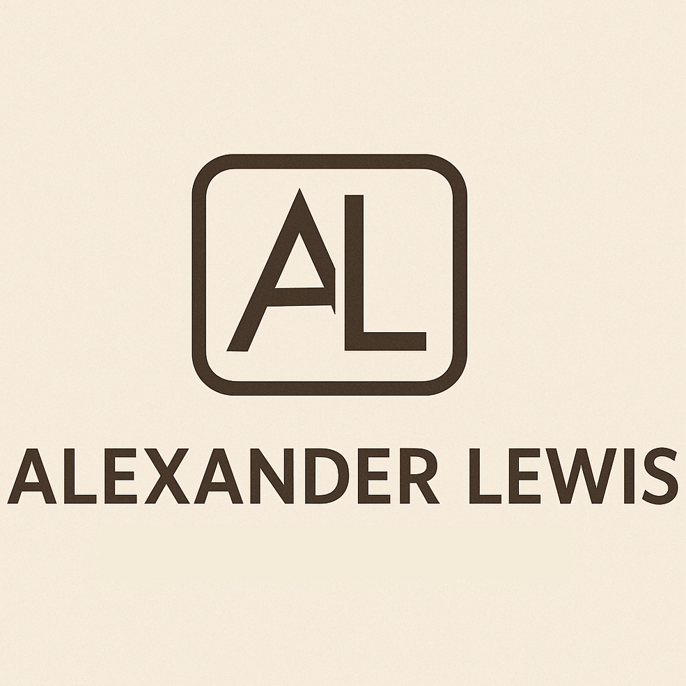

  

---

### About

**Alexander Lewis** delivers independent IT consulting with straightforward expertise and insight. Whether addressing essential IT needs or tackling complex technology challenges, Alexander provides clear, practical solutions to help your organization move forward.

**Contact:** alexander@lewis-net.com 

---

### Services

Areas of specialization include:

- **Device Management & Deployment**  
  Secure onboarding, provisioning, and lifecycle support for endpoints.
- **Infrastructure & Network Planning**  
  Designing secure, scalable, and resilient systems customized for your business.
- **Cloud & Collaboration Solutions**  
  Implementing and supporting modern collaboration and continuity platforms.
- **Process Improvement & Automation**  
  Optimizing workflows and enabling growth through automation and best practices.
- **Security & Risk Management**  
  Managing risk, strengthening cybersecurity, and guiding compliance initiatives.

---

### Approach

Every engagement begins by understanding your unique needs and objectives. You’ll receive a practical, personalized plan along with dependable, ongoing support—ensuring progress at every step.

---

### Mission

Provide reliable technology guidance that helps clients build strong foundations, maintain alignment, and achieve their ambitions.

---

### Referral Policy

New clients are welcomed by professional referral or introduction.

---

<footer style="text-align:center; color:#666; margin-top:3em; padding:1em 0; border-top: 1px solid #ccc;">
  lewis-net.com is owned and operated by Alexander Lewis, sole proprietor. 
  <small style="margin-top:0.5em; display:block;">© 2025 Alexander Lewis. All rights reserved.</small>
</footer>
